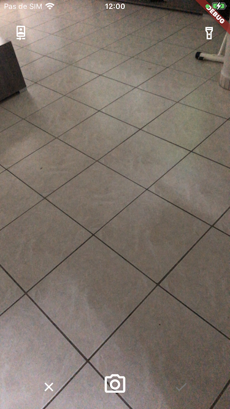
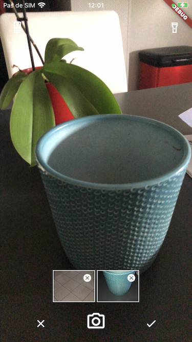

Camera picker

This package will allow you to take multiple camera picture at once and return them for you to process them.

## Features




## Getting started

This package uses the  package, so please follow the setup for iOS and Android. 

## Usage

Full example at . 

```dart
final results = await Navigator.of(context).push(
  MaterialPageRoute(builder: (context) => CameraPicker())
);
if (results != null) {
  //Do whatever you want with the files.
}
```

## Additional information

TODO: Tell users more about the package: where to find more information, how to 
contribute to the package, how to file issues, what response they can expect 
from the package authors, and more.
